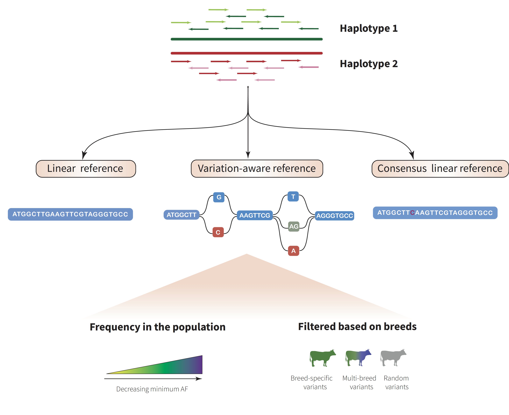

## **Bovine breed-specific augmented reference graphs facilitate accurate sequence read mapping and unbiased variant discovery** [](https://zenodo.org/badge/latestdoi/225894822)


Repository contains scripts to reproduce results of the paper as below:

> Danang Crysnanto and Hubert Pausch. Bovine breed-specific augmented reference graphs facilitate accurate sequence read mapping and unbiased variant discovery. *Biorxiv*

---

### Abstract

**Background**

The current bovine genomic reference sequence was assembled from the DNA of a Hereford cow. The resulting linear assembly lacks diversity because it does not contain allelic variation. Lack of diversity is a drawback of linear references that causes reference allele bias. High nucleotide diversity and the separation of individuals by hundreds of breeds make cattle ideally suited to investigate the optimal composition of variation-aware references.

 

**Results**

We augment the bovine linear reference sequence (ARS-UCD1.2) with variants filtered for allele frequency in dairy (Brown Swiss, Holstein) and dual-purpose (Fleckvieh, Original Braunvieh) cattle breeds to construct either breed-specific or pan-genome reference graphs using the *vg toolkit*. We find that read mapping is more accurate to variation-aware than linear references if pre-selected variants are used to construct the genome graphs. Graphs that contain random variants do not improve read mapping over the linear reference sequence. Breed-specific augmented and pan-genome graphs enable almost similar mapping accuracy improvements over the linear reference. We construct a whole-genome graph that contains the Hereford-based reference sequence and 14 million alleles that have alternate allele frequency greater than 0.03 in the Brown Swiss cattle breed. We show that our novel variation-aware reference facilitates accurate read mapping and unbiased sequence variant genotyping for SNPs and Indels. 


**Conclusions**

We developed the first variation-aware reference graph for an agricultural animal: https://doi.org/10.5281/zenodo.3570312. Our novel reference structure improves sequence read mapping and variant genotyping over the linear reference. Our work is a first step towards the transition from linear to variation-aware reference structures in species with high genetic diversity and many sub-populations.

----





The paper contains four main parts, please go to respective pages for more details:

[Part1](part1_varselect): Variant prioritization   [](https://colab.research.google.com/github/danangcrysnanto/bovine-graphs-mapping/blob/master/part1_varselect/analysis/part1_varselect_colab.ipynb) [](https://mybinder.org/v2/gh/danangcrysnanto/bovine-graphs-mapping/master?filepath=part1_varselect/analysis/part1_varselect.ipynb)

[Part2](part2_breedgraphs) : Breeds graphs             [](https://colab.research.google.com/github/danangcrysnanto/bovine-graphs-mapping/blob/master/part2_breedgraphs/analysis/part2_breedgraphs_colab.ipynb) [](https://mybinder.org/v2/gh/danangcrysnanto/bovine-graphs-mapping/master?filepath=part2_breedgraphs/analysis/part2_breedgraphs.ipynb)

[Part3](part3_consensusgenome): Consensus genome     [](https://colab.research.google.com/github/danangcrysnanto/bovine-graphs-mapping/blob/master/part3_consensusgenome/analysis/part3_consensusgenome_colab.ipynb) [](https://mybinder.org/v2/gh/danangcrysnanto/bovine-graphs-mapping/master?filepath=part3_consensusgenome/analysis/part3_consensusgenome.ipynb)

[Part4](part4_variantgenotyping): Variant genotyping      [](https://colab.research.google.com/github/danangcrysnanto/bovine-graphs-mapping/blob/master/part4_variantgenotyping/analysis/part4_variantgenotyping_colab.ipynb) [](https://mybinder.org/v2/gh/danangcrysnanto/bovine-graphs-mapping/master?filepath=part4_variantgenotyping/analysis/part4_variantgenotyping.ipynb)

*Note*: 

The data analyses utilized the ETH Zurich Leonhard Open High Performance Computing because of the high computing resources requirement. Reproducing in a local (dekstop) machine will not be possible in terms of memory and computing time. 

However, final results are available in `result` folder  and we have setup integration with publicly available cloud computing notebook, final data analyses can be repeated using `open in colab` (recommended because of the quick access) or  `launch binder` button as above, also possible in local dekstop after `cloning` the repo. 

The accompanying raw data for analyses are available via [Zenodo](https://doi.org/10.5281/zenodo.3570312), please download and untar-unzip the files. All raw data are available in `data` folder after unzipping. 

```
tar -zxvf data.tar.gz
```

Archived versions:

Code: [](https://zenodo.org/badge/latestdoi/225894822)

Data: [](https://doi.org/10.5281/zenodo.3570312)

----

### Contributor:

[Danang Crysnanto](mailto:danang.crysnanto@usys.ethz.ch)  
[Animal Genomics ETH Zurich](http://www.ag.ethz.ch/)     	

Email: danang.crysnanto@usys.ethz.ch   

License: [MIT](LICENSE)


