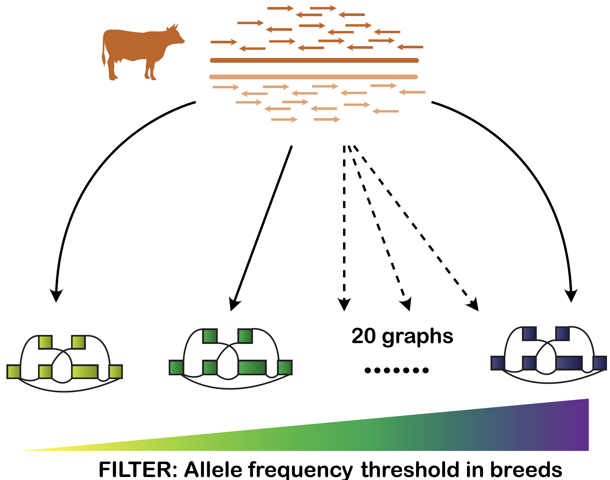

## Part1 Variant Prioritization

In this part, the we evaluated the number and frequency of the variants augmented to the graphs, as illustrated in the figure below.



---

#### Requirement

1. VG toolkit version v1.17.0 ["Candida"](https://github.com/vgteam/vg), we do not test the script in other vg version

2. Jq,[ JSON pre-processor](https://stedolan.github.io/jq/)

Make sure that the program are in the `$PATH`	

---

The analysis can be reproduced as follow:

#### 1.Simulated reads from each breeds

We simulated 10 million reads from haplotypes of chromsome 25 from a selected single animals from each breeds . The scripts is in `scripts/sim_reads.sh`, which need reference genome in `../data/utilities/UCD12.fa`, and the phased vcf from a single animal in each breed is available in`../data/part1/vcf_sim`. 

We simulate short reads using `vg sim` for more details please refer to [Here](https://github.com/vgteam/vg/wiki/Simulating-reads-with-vg-sim). 

Read simulations done as below

```bash
scripts/sim_reads.sh -a ${breeds}_sim -b ${breeds}
```

Breeds are the population of interest: BSW, OBV, FV, and HOL. 

This will generate some files as below:

1. `${breeds}_sim.gam` contained the simulated reads in interleaved GAM format
2. `${breeds}_sim_{1,2}.fastq.gz` contained combined reads from the first and second pair in fastq format
3. `${breeds}_sim.fastq.gz` contained combined reads from first and second, which is treated as single end
4. `${breeds}_truth_all.tsv.gz` contained the metadata from simulation, where column 1,2 ,3 ,and 8 are read name, chr truth, position truth, and number nodes that are novel (not part of reference paths) 

We have already provided the simulated reads in 4 breeds in `../data/part1/reads_sim`. 

#### 2. Graph construction and mapping

Filtered variants according to allele frequency in breeds and construct graphs from it. Then mapping simulated reads from each breed to the all genome graphs constructed from the same breeds

Next, we need to create a vcf files with variants filtered according to the minimum allele frequency. We used allele frequency threshold from 0-0.1 with 0.01 increment and 0.1-1.0 with 0.1 increment,  20 interval for each breeds. 

The vcf files filtered based on the allele frequency are provided in `../data/utilities/vcf_freq` with format identifier as follow: `${breeds}_${freq_threshold}_phased_sampled.vcf.gz`. 

We used the vcf files to create a graphs with UCD1.2 as backbone, totalling to 80 graphs from each breeds. Finally, we mapped the simulated reads for each breeds (as above) to the graphs from the same breeds. 

Scripts below used to do graph construction and mapping both in single- and paired-end mapping mode. 

```bash
scripts/af_graph.sh -b ${breeds} -t ${threshold}
```

Where threshold is between `0,0.01,0.02, ... ,0.1,0.2, ... ,1.0`. 

This will produce many `compare.gz` files as  `{breeds}_{threshold}_${mapping_mode}.compare.gz`., where column 1,2,3,  and 10 are read name, mapping status (0:incorrect, 1:correct), mapping quality, mapping score. We used second column to calculate the proportion of mapping error. Graph in `vg`format, all three graph indexes, `xg`,`gcsa`, and `gbwt`index is available in `graph` folder after finished. 

#### 3 Data analysis and plotting 

Data analysis and plotting is available interactively through Jupyter notebook in [`analysis/part1_varselect.ipynb`](analysis/part1_varselect.ipynb)	


