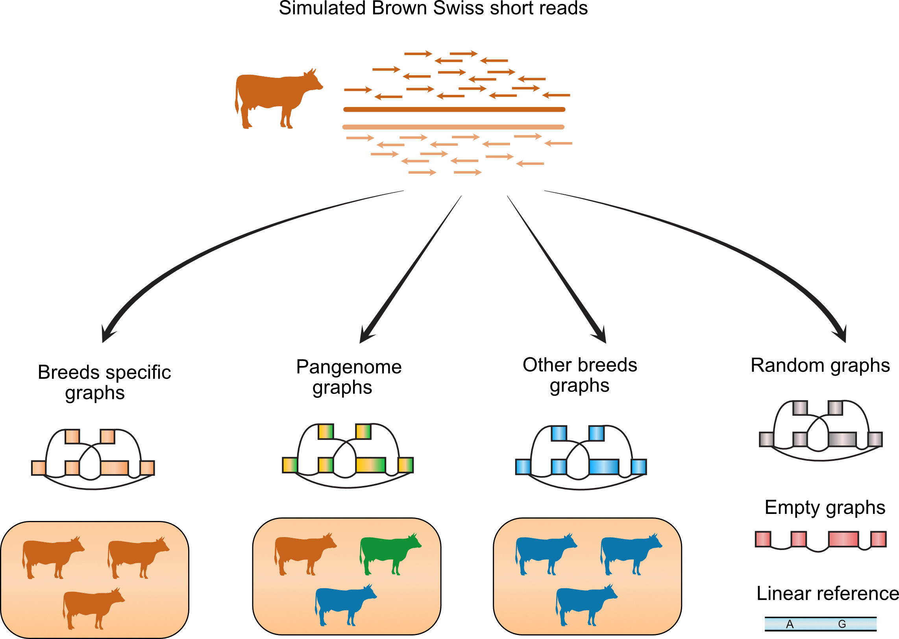

## Part 2 Mapping to the genome graphs filtered based on breeds

In this part, we constructed graphs with the variants filtered based on its presence in specific breeds, which is detailed below:

- Breed specific graphs

  Variants were discovered and allele frequency were calculated in specific breeds. 

- Pangenome graphs

  Variants were combined across four populations, and allele frequency calculated in four populations.

- Random graphs

  We selected variants randomly without allele frequency consideration from 1000 bulls [variant catalogues](http://www.1000bullgenomes.com/doco/ARS1.2PlusY_BQSR_v2.vcf.gz)	

We consider only chromosome 25 for experiment, where each graphs contained 243,145 variants with minimum allele frequency 0.03. 

We mapped the Brown Swiss simulated reads as in the part1, to the all scenarios presented below:




-----

### Requirement

1. VG toolkit version v1.17.0 ["Candida"](https://github.com/vgteam/vg), we do not test the script in other vg version
2. Jq,[ JSON pre-processor](https://stedolan.github.io/jq/)
3. R with `tidyverse`, `optparse`, and `data table` packages installed

Make sure that the program are in the `$PATH`	and raw data have been downloaded from Zenodo. 


----

### Details of experiment


#### 1. Filtered variants based on breeds and allele frequency	

We randomly sampled 243145 variants from each breeds (or combined breeds) 10 times, and constructed graphs based on the selected variants. 

We have provided the phased vcf files in the data folder `../data/part2/vcf_breed` with identifier `${breeds}_${replication}_003_phased` where breeds are BSW, OBV, HOL, FV, pangenome or random (see above) and the replications indicate the number of replicates (1-10). 


#### 2. Map the simulated reads to the constructed graphs

Graphs are constructed based on the input  vcf files as defined above and then Brown Swiss simulated reads were mapped to the generated graphs. 

Run command below for graphs construction, mapping, and collecting read mapping statistics

```
scripts/map_breedgraph.sh -b ${breed_graph} -r ${rep}
```

Breed graphs are the graphs constrcuted above (BSW, OBV, HOL, FV, pangenome) and the rep is the replicates (1-10). 

Graphs are stored in `graph` folder, and mapped read files are available in `mapping_result` folder.  Mapping statistics stored in file with `.tsv` ending, which used for subsequent analysis. 


#### 3. Data analysis

The analysis presented in the paper can be followed interactively through Jupyter notebook in [`analysis/part2_breedgraphs.ipynb`](analysis/part2_breedgraphs.ipynb)	or via `Google colab`  [](https://colab.research.google.com/github/danangcrysnanto/bovine-graphs-mapping/blob/master/part2_breedgraphs/analysis/part2_breedgraphs_colab.ipynb). 


