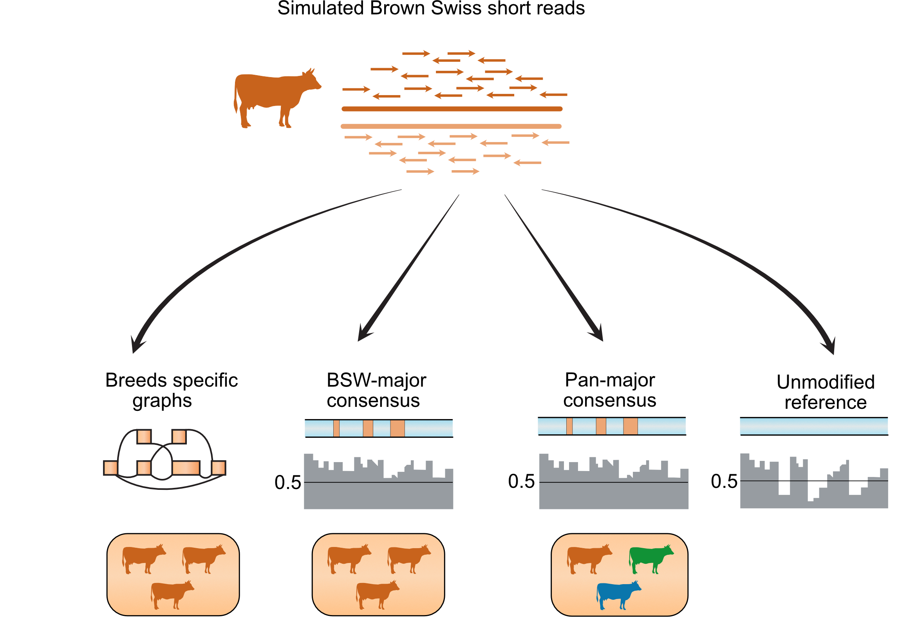

## Part 3 Comparison between consensus and genome graphs

In addition of inclusion genetic diversity in the graphs, ones could also mitigate mapping bias by adjusting reference genome to the targeted population, or so called as consensus genome approach. In this part, we replaced bases in the UCD1.2 bovine reference genome with the most frequent allele in the the population. We consider two types of consensus:

#### 1. Major-BSW

We modified reference bases with major allele where frequency calculated based on Brown Swiss population.

#### 2. Major-Pan

We modified reference bases with major allele where frequency calculated based combined four cattle population (BSW, OBV, HOL, and FV).


	


----

#### Requirements

1. VG toolkit version v1.17.0 ["Candida"](https://github.com/vgteam/vg), we do not test the script in other vg version

2. Jq,[ JSON pre-processor](https://stedolan.github.io/jq/)

3. Java or JDK and [`vcf2diploid.jar`](https://github.com/abyzovlab/vcf2diploid) (already in the data folder) 

4. UCSC [`liftover`](https://genome.ucsc.edu/cgi-bin/hgLiftOver) tools (available locally in data folder)

5. R (we used version  3.4.2) with `Tidyverse` library

    

Make sure that the program are in the `$PATH` and raw data have been downloaded from Zenodo. 


___

#### Details of the experiments

#### 1. Creating consensus genome based on major allele

We calculated two consensus, `major-BSW`  and `major-pan` where AF calculated based on Brown Swiss and combined population respectively. We provided the variants in `../data/part3/vcf_consensus` (with frequency file and the vcf files). 

We modified the original reference with major variants defined in the vcf file with `vcf2diploid` tools. *Vcf2diploid* is a tool to generate parental and maternal haplotypes by replacing reference with variants from phased vcf. For our purpose, we inputted a single sample vcf with all genotypes were homozygous alternate (thus all alleles will be replaced with corresponding variants and outputted the same two fasta haplotypes). Since replacing reference allele with insertion and deletions causing genomics coordinate shift, we applied the accompanying *chain file* produced by *vcf2diploid* to convert the coordinates of the simulated reads from the original to the modified reference using local UCSC liftOver tools. 


#### 2. Read mapping of the consensus genome

We mapped the consensus linear genome with `bwa` and `vg` (by first creating an empty graphs without variations ). Scripts `consensus_liftover.sh` will create consensus genome, perform liftover, mapping consensus genome to `bwa` and to consensus graphs with `vg`. 

```bash
scripts/consensus_liftover.sh ${consensus_type}
```

Where consensus type is either `major-BSW` or `major-pan`.

The scripts will generate modified consensus genome as `25_anims_major-BSW.fa` and `25_anims_major-pan.fa`. Additionally, mapping statistics generated in `compare.gz` file that are required for subsequent data analysis. 


#### 3. Data Analysis

The analysis presented in the paper can be followed interactively through Jupyter notebook in [`analysis/part3_consensusgenome.ipynb`](analysis/part3_consensusgenome.ipynb)	


