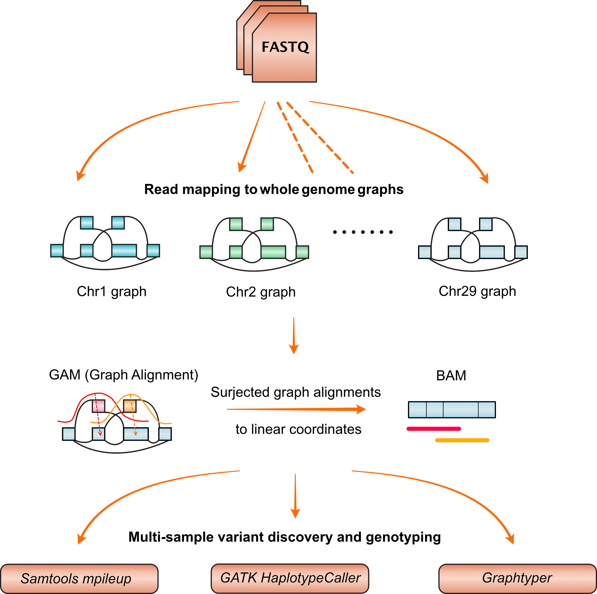
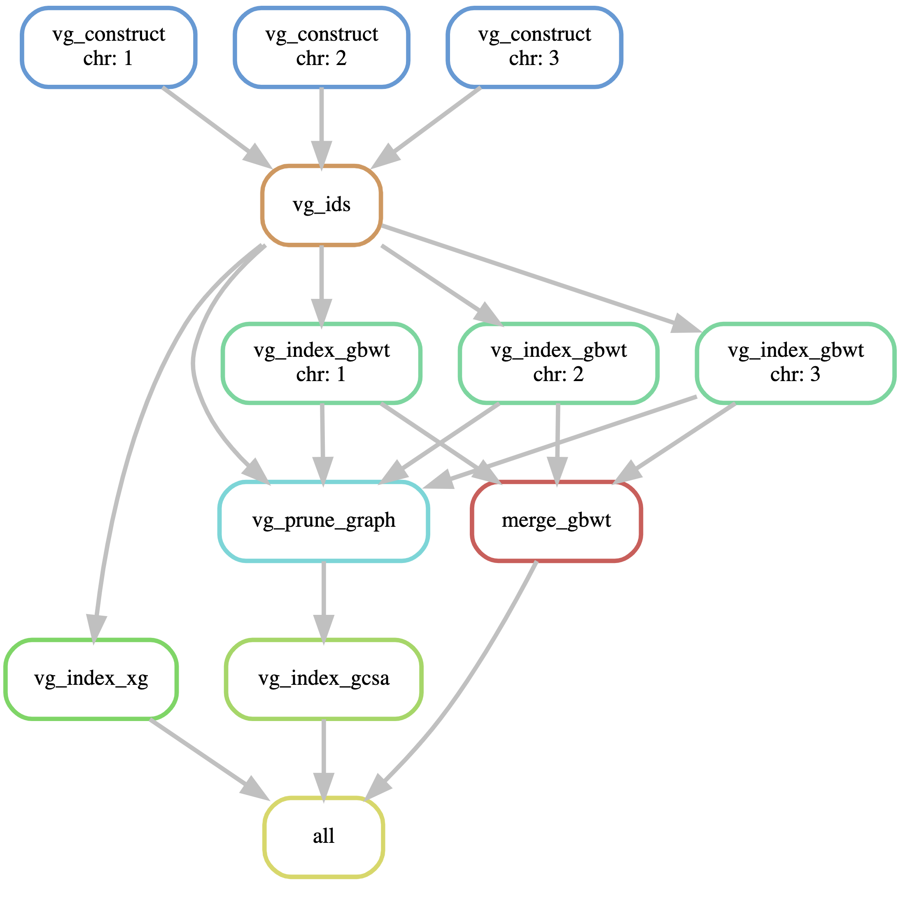
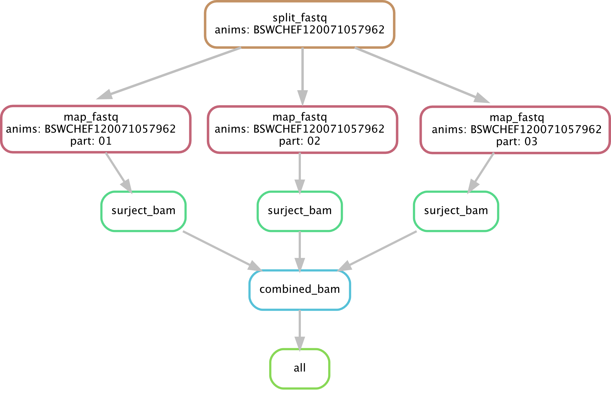

## Part 4 Read mapping and variant genotyping from whole genome graphs

In this part of analysis, we constructed whole genome graphs from ~14.1 million autosomal variants (Chr1-29) augmented to the UCD1.2 reference. We then assessed its utility for read mapping and sequence variant genotyping (see figure below). 


	


----

#### Requirements

1. VG toolkit version v1.17.0 ["Candida"](https://github.com/vgteam/vg), we do not test the script in other vg version
2. Python 3.6 with `Snakemake` (version 5.5.4)
3. Samtools
4. Fastp 
5. R (version  3.4.2) with `Tidyverse` library  


Make sure that the program are in the `$PATH` and raw data have been downloaded from Zenodo. Most of the work in this part is implemented using `Snakemake` as workflow management system. 

___

#### Details of the experiments

#### 1. Creating whole genome graphs 

We implemented the whole genome graph construction in a `Snakemake` pipeline. Make sure to edit the `construct_index_config` with the `file` and `path` specifications. The phased variants used to construct graph is in `data/part4/vcf_construct`. 

The pipeline can be run in `screen` mode as below

```
mv scripts
snakemake --snakefile construct_index_snake.py
```

The overview of the pipeline (for example only including chr1-3) is visualized as below. Graph will be constructed separately for each chromosome with `vg construct`, then the node id is updated (so no two nodes can have the same clashed node ID) using `vg ids`. We then used the `full graphs` to create `xg` and `gbwt` indexes. For k-mer/query index we first need to simplify the graphs using `vg prune`, but we used `gbwt` index to restore edges that are part of the haplotypes. The query or `gcsa` index is finally created using `vg index gcsa`.





**Note**: We used High Performance Cluster to run the pipeline. The pipeline need *at least* 128 GB RAM, 2 TB  disk space, and an intensive I/O. It will run for about ~24 hours. The graph is generated at `$outdir/graph` folder with the three accompanying indexes, `xg` (topological),`gcsa` (kmer or query index), and `gbwt` (haplotype index) in `$outdir/index` folder. 

We have already provided the the BSW whole genome graphs (including indexes) constructed from this pipeline in data folder at `data/part4/BSW_graphs` . 


#### 2. Read mapping to the whole genome graphs

We then mapped 10 short-read data to the Brown Swiss whole genome graphs. We implemented this mapping experiment also with `Snakemake` pipeline. 

The pipeline for graph mapping can be run in `screen` mode with following command:

```
mv scripts
snakemake --snakefile split_mapvg_snake.py
```


The pipeline (see below for example) first will use `fastp` to trim and filter low quality reads and then split the fastq files into a smaller files of `80` million reads ~1X coverage. We then mapped each splitted fastq separately to whole genome graphs using `vg map` , producing `GAM`  or graph alignment file.  Since we wanted to use standard variant callers (e.g., `Samtools`, `GATK`, `Graphtyper`), we surjected graph alignment coordinate to the corresponding reference paths using `vg surject`, producing `BAM` files that are compatible with the current variant caller. We finally utilised variant calling pipeline for `Samtools`, `GATK`, `Graphtyper` that we already established in our previous paper ([See here for more details](https://github.com/danangcrysnanto/Graph-genotyping-paper-pipelines)) to discover and genotype variants from surjected graph alignments. 





#### 3. Data Analysis

The analysis presented in the paper can be followed interactively through Jupyter notebook in [`analysis/part4_variantgenotyping.ipynb`](analysis/part4_variantgenotyping.ipynb). 

​	

